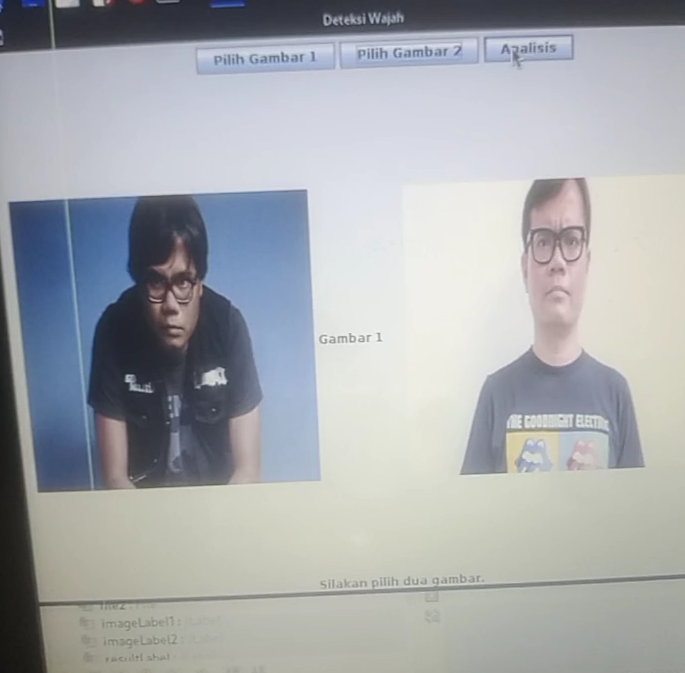

# compare-face-recognition

Face Recognition Software to compare 2 pictures of person to make sure that he/she is the same person.

this is the preview of the application.
- Select Picture 1 and Picture 2. after that you press the analyze. and the machine will process your picture 1 and picture 2 is that a same person or not!

Requirement.
• Java
•Python
•Library Deepface from Python

How to use?
- Input the picture 1/Gambar 1
- Input the picture 2/Gambar 2
- Click Analyze and then the machine Will process compare the face.
- The result will be given

note: orang_sama = same person
Orang_berbeda = different person

Download from sourceforge.
https://sourceforge.net/projects/compare-face-recognition/
